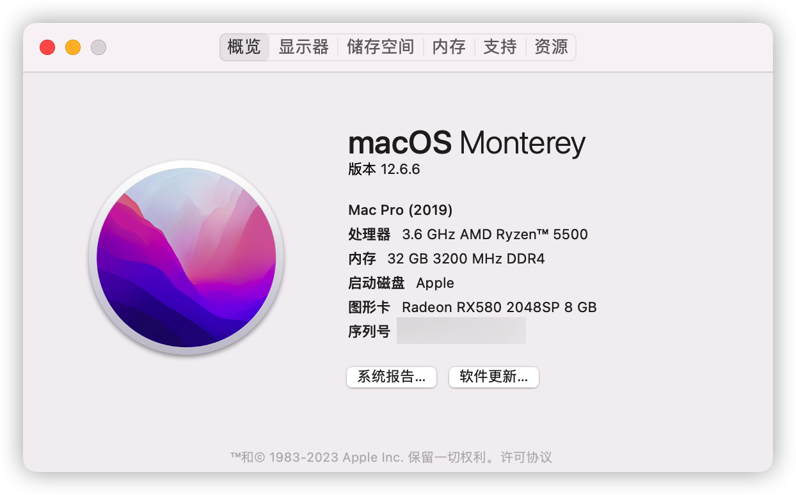
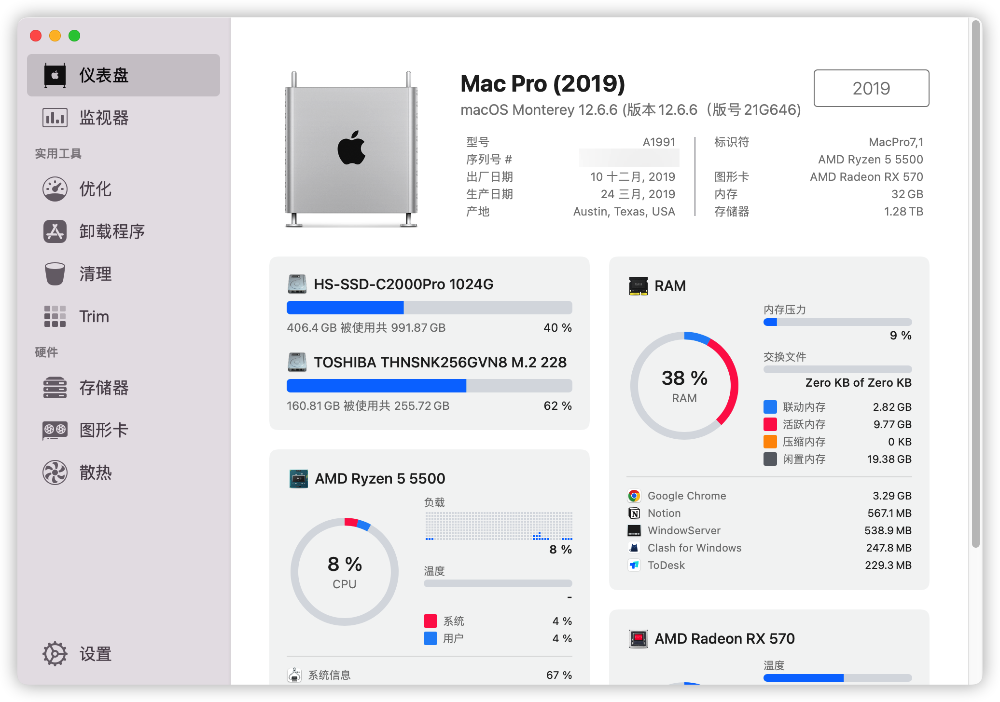
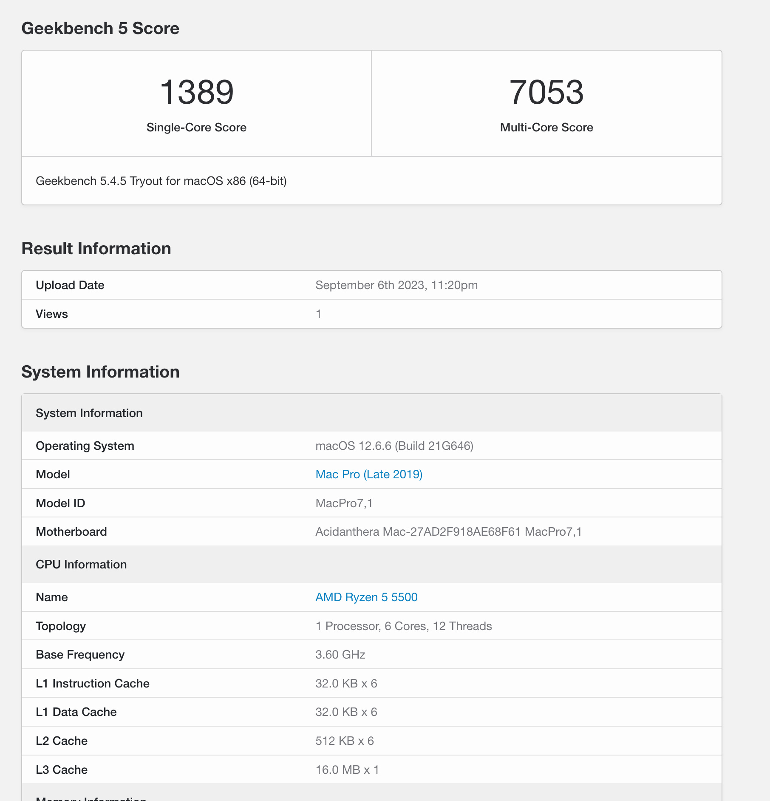
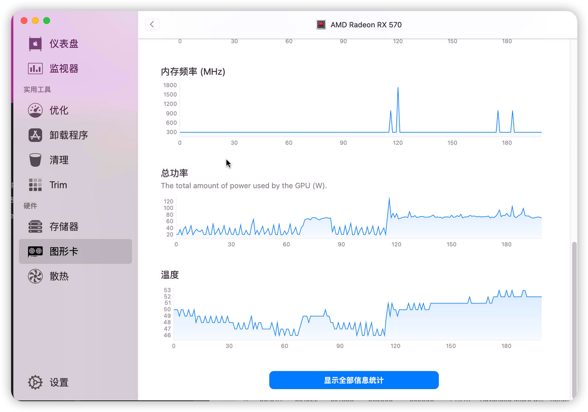

# Hackintosh_Ryzen5500_onda_B450MW
Hackintosh Monterey for Ryzen5500, Onda B450M-W, RX580 2048sp

## 基本信息
* OC 0.9.4, Ryzen5500, Onda B450 SW, RX580 2048sp

> ✅: 已测试支持,, ✔️: 应该支持 ❌: 不支持, ❓: 未知  

| macOS 版本 | 是否支持 |
| :--------: | :------: |
|  Big Sur   |    ✔️     |
|  Monterey  |    ✅     |
|  Ventura   |    ✔️     |

## 硬件
|   名称    |         型号         |
| :-------: | :------------------: |
|   主板    |     Onda B450 SW     |
|    CPU    |    AMD Ryzen5500     |
| CPU散热器 |    乔思伯 CR1400     |
|   显卡    |     RX580 2048sp     |
|   内存    | 光威 16G 3200Mhz x2  |
|   硬盘    | 海康威视 C2000pro 1T |
| 蓝牙/WiFi |          无          |
|板载以太网	|Realtek RTL8111|
|板载声卡	|Realtek  ALC662|
|   机箱    |       小喆C2P        |
|   电源    |     鑫谷 AN650w      |

* RX580 2048sp 已刷 蓝宝石RX570 驱动, 并注入相关信息 link

## TODO
* 测试黑果完美程度
* USB 定制
* 清理OC工具
* 移除部分DEBUG信息
* 图形界面EFI + 定制化主题
  * https://github.com/IITII/OpenCore-Themes

## Work
* 主板 CPU 温度显示(使用AMD Power Gadget 可正常读取和调频)
* GPU 功耗自动调整
* 独显DP输出
* 显卡温度显示
* 声卡输出
* 图形界面EFI
## 未测试
* 睡眠/唤醒（台式机目前没有休眠需求
* 显卡风扇转速显示
## Not Work
* 主板风扇转速(Windows 下也看不到)
* WIFI/蓝牙(无设备)
* 隔空投送(依赖于蓝牙和 WIFI)
## 更新记录
* 初版
## 成果

* RX580 刷了之后锁屏功耗大概在 20~40w 左右, 之前一直 120W







## 非EFI问题及解决方案

* HIDPI: https://github.com/xzhih/one-key-hidpi
* 亮度调节工具（前提是显示器支持调节）: https://github.com/MonitorControl/MonitorControl

* windows和mac时间不同步问题 windows下管理员身份运行命令
```pwsh
Reg add HKLM\SYSTEM\CurrentControlSet\Control\TimeZoneInformation /v RealTimeIsUniversal /t REG_DWORD /d 1
```
* windows/mac 蓝牙设备共用需要重新配对的问题 解决方案：https://www.reddit.com/r/hackintosh/comments/mtvj5m/howto_keep_bluetooth_devices_paired_across_macos/

> 当然也有现成的脚本：https://github.com/digitalbirdo/BT-LinkkeySync  
## BIOS 设置
### Disable
* Fast Boot
* Secure Boot
* Serial/COM Port
* Parallel Port
* Compatibility Support Module (CSM) (Must be off in most cases, GPU errors/stalls like gIO are common when this option is enabled)
* IOMMU
### Enable
* Above 4G Decoding
* EHCI/XHCI Hand-off
* OS type: Windows 8.1/10 UEFI Mode (some motherboards may require "Other OS" instead)
* SATA Mode: AHCI

## 参考

* https://dortania.github.io/OpenCore-Desktop-Guide
